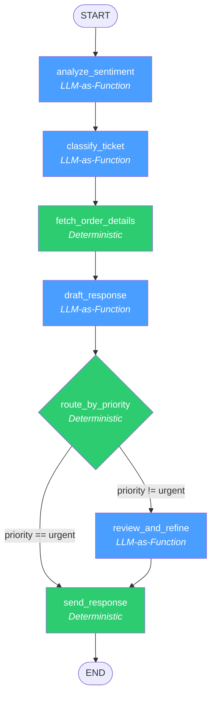

# Execution Graph: Customer Support Agent

## Mermaid Diagram



**Legend**: Blue = LLM-as-Function | Green = Deterministic

## Node Detail Table

| Node | Type | LLM Model | Inputs | Outputs | Edges In | Edges Out |
| --- | --- | --- | --- | --- | --- | --- |
| `analyze_sentiment` | LLM-as-Function | GPT-4o → GPT-4o-mini | `message` | `sentiment` (enum: 4 values) | START | `classify_ticket` (static) |
| `classify_ticket` | LLM-as-Function | GPT-4o → GPT-4o-mini | `message` | `category` (enum: 5), `priority` (enum: 4) | `analyze_sentiment` | `fetch_order_details` (static) |
| `fetch_order_details` | Deterministic | N/A | `message` | `order_info` (dict) | `classify_ticket` | `draft_response` (static) |
| `draft_response` | LLM-as-Function | GPT-4o → GPT-4o-mini | `message`, `category`, `priority`, `sentiment`, `order_info` | `draft_response` (text) | `fetch_order_details` | `route_by_priority` (conditional) |
| `route_by_priority` | Deterministic | N/A | `priority` | routing decision | `draft_response` | `review_and_refine` OR `send_response` |
| `review_and_refine` | LLM-as-Function | GPT-4o → GPT-4o-mini | `message`, `draft_response` | `final_response` (text) | `route_by_priority` | `send_response` (static) |
| `send_response` | Deterministic | N/A | `ticket_id`, `customer_email`, `category`, response text | `final_response`, email status, CRM log | `review_and_refine` or `route_by_priority` | END |

## State Schema

```python
class TicketState(TypedDict):
    ticket_id: str          # Input — passed through
    customer_email: str     # Input — used by send_response
    message: str            # Input — read by most nodes
    category: str           # Set by classify_ticket
    priority: str           # Set by classify_ticket, read by route_by_priority
    order_info: dict        # Set by fetch_order_details
    draft_response: str     # Set by draft_response
    final_response: str     # Set by review_and_refine or send_response
    sentiment: str          # Set by analyze_sentiment
```
